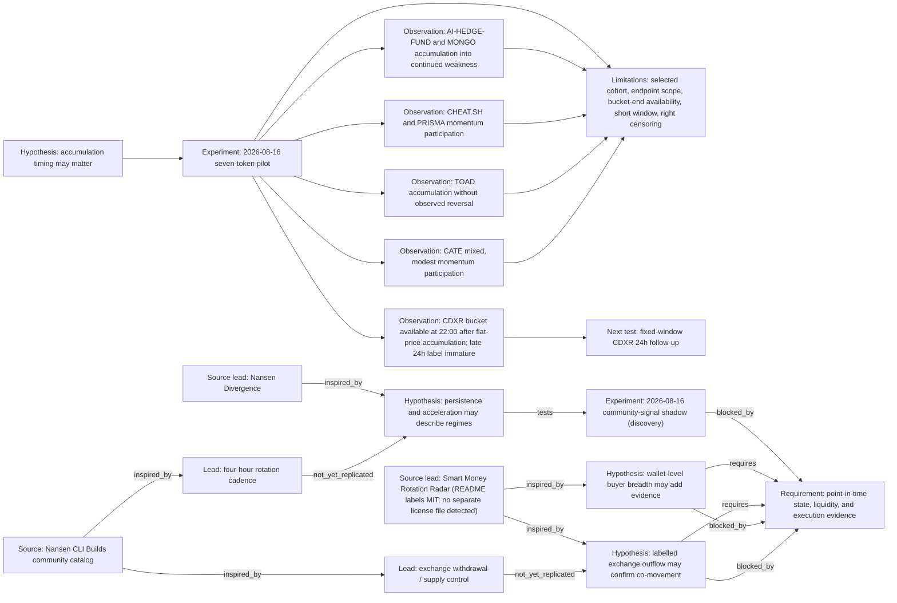

# Research evidence graph

Stable node IDs preserve the lineage from the frozen hypothesis to observations, limitations, and the next test.

Observation evidence:

- [`obs_cdxr_flat_accumulation`](../research/experiments/2026-08-16-seven-token-pilot/REPORT.md#cdxr-label-maturity)
- [`obs_weakness_continues`](../research/experiments/2026-08-16-seven-token-pilot/REPORT.md#event-weighted-timing-analysis)
- [`obs_momentum_participation`](../research/experiments/2026-08-16-seven-token-pilot/REPORT.md#event-weighted-timing-analysis)
- [`obs_toad_no_reversal`](../research/experiments/2026-08-16-seven-token-pilot/REPORT.md#event-weighted-timing-analysis)
- [`obs_cate_mixed`](../research/experiments/2026-08-16-seven-token-pilot/REPORT.md#event-weighted-timing-analysis)
- [`src_nansen_cli_builds`](https://release.nansen.ai/en/help/articles/6399546-nansen-cli-builds) — community claims are leads only.
- [`src_nansen_divergence`](https://github.com/Ridwannurudeen/nansen-divergence) — direct source repository, which declares MIT; no community claim is treated as validated.
- [`src_smrr`](https://github.com/Iziedking/Narrative-pulse) — direct Smart Money Rotation Radar source repository; its README labels the project MIT, while no separate license file was detected. No code or expression is copied.

[Powered by Nansen API](https://nansen.ai/). Public evidence follows Nansen's [redistribution guidance](https://docs.nansen.ai/guides/redistribution-guide).
