# Research evidence graph

Stable node IDs preserve the lineage from the frozen hypothesis to observations, limitations, and the next test.

```mermaid
flowchart LR
    hyp_smart_money_timing["Hypothesis: accumulation timing may matter"]
    exp_20260816_seven_token_pilot["Experiment: 2026-08-16 seven-token pilot"]
    obs_cdxr_flat_accumulation["Observation: CDXR bucket available at 22:00 after flat-price accumulation; late 24h label immature"]
    obs_weakness_continues["Observation: AI-HEDGE-FUND and MONGO accumulation into continued weakness"]
    obs_momentum_participation["Observation: CHEAT.SH and PRISMA momentum participation"]
    obs_toad_no_reversal["Observation: TOAD accumulation without observed reversal"]
    obs_cate_mixed["Observation: CATE mixed, modest momentum participation"]
    lim_selected_endpoint_window["Limitations: selected cohort, endpoint scope, bucket-end availability, short window, right censoring"]
    next_cdxr_fixed_window["Next test: fixed-window CDXR 24h follow-up"]

    hyp_smart_money_timing --> exp_20260816_seven_token_pilot
    exp_20260816_seven_token_pilot --> obs_cdxr_flat_accumulation
    exp_20260816_seven_token_pilot --> obs_weakness_continues
    exp_20260816_seven_token_pilot --> obs_momentum_participation
    exp_20260816_seven_token_pilot --> obs_toad_no_reversal
    exp_20260816_seven_token_pilot --> obs_cate_mixed
    exp_20260816_seven_token_pilot --> lim_selected_endpoint_window
    obs_cdxr_flat_accumulation --> next_cdxr_fixed_window
    obs_weakness_continues --> lim_selected_endpoint_window
    obs_momentum_participation --> lim_selected_endpoint_window
    obs_toad_no_reversal --> lim_selected_endpoint_window
    obs_cate_mixed --> lim_selected_endpoint_window

    src_nansen_cli_builds["Source: Nansen CLI Builds community catalog"]
    src_nansen_divergence["Source lead: Nansen Divergence"]
    src_smrr["Source lead: Smart Money Rotation Radar (README labels MIT; no separate license file detected)"]
    lead_supply_control["Lead: exchange withdrawal / supply control"]
    lead_four_hour_rotation["Lead: four-hour rotation cadence"]
    hyp_persistence_acceleration["Hypothesis: persistence and acceleration may describe regimes"]
    hyp_buyer_breadth["Hypothesis: wallet-level buyer breadth may add evidence"]
    hyp_exchange_outflow_confirmation["Hypothesis: labelled exchange outflow may confirm co-movement"]
    req_point_in_time_state["Requirement: point-in-time state, liquidity, and execution evidence"]
    exp_20260816_community_signal_shadow["Experiment: 2026-08-16 community-signal shadow (discovery)"]

    src_nansen_cli_builds -->|inspired_by| lead_supply_control
    src_nansen_cli_builds -->|inspired_by| lead_four_hour_rotation
    src_nansen_divergence -->|inspired_by| hyp_persistence_acceleration
    src_smrr -->|inspired_by| hyp_buyer_breadth
    src_smrr -->|inspired_by| hyp_exchange_outflow_confirmation
    lead_supply_control -->|not_yet_replicated| hyp_exchange_outflow_confirmation
    lead_four_hour_rotation -->|not_yet_replicated| hyp_persistence_acceleration
    hyp_persistence_acceleration -->|tests| exp_20260816_community_signal_shadow
    exp_20260816_community_signal_shadow -->|blocked_by| req_point_in_time_state
    hyp_buyer_breadth -->|requires| req_point_in_time_state
    hyp_exchange_outflow_confirmation -->|requires| req_point_in_time_state
    hyp_buyer_breadth -->|blocked_by| req_point_in_time_state
    hyp_exchange_outflow_confirmation -->|blocked_by| req_point_in_time_state

    theory_flow_only_benchmark["Theory H0: flow-only benchmark"]
    theory_distribution_risk_off["Theory H1: distribution risk-off veto"]
    theory_breadth_acceleration["Theory H2: breadth/acceleration inflection"]
    theory_holder_breadth_positive["Theory H3+: holder-breadth positive arm"]
    theory_holder_breadth_nonpositive["Theory H3-: holder-breadth non-positive arm"]
    theory_sustained_markup["Theory H4: sustained markup confirmation"]
    theory_buyer_exchange["Theory H5: buyer-breadth plus exchange confirmation"]
    exp_20260817_paper_strategy_feasibility["Experiment: 2026-08-17 paper-strategy feasibility (discovery)"]
    obs_no_paper_strategy["Decision: no entry or paired veto selected for paper"]
    obs_holder_breadth_advance["Observation: H3 positive-arm spreads both positive; descriptive advance only"]
    req_beta_pit_execution["Requirement: complete beta/PIT history, pagination, liquidity, quotes, and costs"]

    theory_flow_only_benchmark -->|tests| exp_20260817_paper_strategy_feasibility
    theory_distribution_risk_off -->|tests| exp_20260817_paper_strategy_feasibility
    theory_breadth_acceleration -->|tests| exp_20260817_paper_strategy_feasibility
    theory_holder_breadth_positive -->|tests| exp_20260817_paper_strategy_feasibility
    theory_holder_breadth_nonpositive -->|tests| exp_20260817_paper_strategy_feasibility
    theory_sustained_markup -->|tests| exp_20260817_paper_strategy_feasibility
    exp_20260817_paper_strategy_feasibility -->|rejected_for_paper| theory_breadth_acceleration
    exp_20260817_paper_strategy_feasibility -->|rejected_for_paper| theory_sustained_markup
    exp_20260817_paper_strategy_feasibility -->|rejected_for_paper| obs_no_paper_strategy
    exp_20260817_paper_strategy_feasibility -->|descriptive_advance| obs_holder_breadth_advance
    theory_distribution_risk_off -->|blocked_by_no_entry| obs_no_paper_strategy
    theory_buyer_exchange -->|blocked_by| req_beta_pit_execution
    exp_20260817_paper_strategy_feasibility -->|blocked_by| req_beta_pit_execution

    protocol_identity_blinded_gpt["Protocol: identity-blinded two-pass gpt-5.6-sol, no tools"]
    exp_20260817_gpt_prospective_pilot["Experiment: 2026-08-17 GPT prospective pilot (terminal unscorable)"]
    req_sealed_common_execution["Requirement: sealed common DEX fills and closed 5m OHLCV"]
    lim_one_token_observation["Limitation: one page-local token and one four-hour observation"]
    next_gpt_prospective_outcome["Next observation: sealed decision then delayed paper settlement"]
    obs_gpt_preflight_401["Terminal observation: model-access preflight HTTP 401; zero Nansen calls/credits"]
    audit_gpt_pilot_invalidated["Audit: unusable; non-API credential should have failed local validation"]
    next_gpt_successor_preregistration["Experiment: separately preregistered GPT pilot successor"]
    exp_20260817_gpt_prospective_pilot_successor["Experiment: 2026-08-17 GPT prospective pilot successor (terminal unscorable)"]
    obs_successor_account_headers_missing["Terminal observation: model access passed; Nansen account use/remaining headers absent"]

    exp_20260817_paper_strategy_feasibility -->|freezes_six_records_for| exp_20260817_gpt_prospective_pilot
    protocol_identity_blinded_gpt -->|tested_by| exp_20260817_gpt_prospective_pilot
    req_sealed_common_execution -->|required_by| exp_20260817_gpt_prospective_pilot
    exp_20260817_gpt_prospective_pilot -->|limited_by| lim_one_token_observation
    exp_20260817_gpt_prospective_pilot -->|preregistered_next| next_gpt_prospective_outcome
    exp_20260817_gpt_prospective_pilot -->|terminated_before_snapshot| obs_gpt_preflight_401
    obs_gpt_preflight_401 -->|invalidated_for_model_comparison| audit_gpt_pilot_invalidated
    audit_gpt_pilot_invalidated -->|requires_new_preregistration| next_gpt_successor_preregistration
    next_gpt_successor_preregistration -->|realized_as| exp_20260817_gpt_prospective_pilot_successor
    exp_20260817_paper_strategy_feasibility -->|freezes_same_six_records_for| exp_20260817_gpt_prospective_pilot_successor
    protocol_identity_blinded_gpt -->|tested_by| exp_20260817_gpt_prospective_pilot_successor
    exp_20260817_gpt_prospective_pilot_successor -->|terminated_before_selection| obs_successor_account_headers_missing

    exp_20260818_holder_breadth_historical["Experiment: 2026-08-18 holder-breadth historical discovery v1"]
    obs_historical_pricing_incomplete["Terminal observation: screener used 5 credits but omitted quoted-cost header"]
    obs_historical_bsc_alias["Provider mismatch: requested bnb, returned bsc"]
    next_historical_recovery["Next experiment: source-bound recovery without screener rerun"]
    exp_20260818_holder_breadth_recovery["Experiment: source-bound holder-breadth recovery v2"]
    obs_holder_breadth_mean_median_conflict["Observation: positive token mean, negative typical-event spread"]
    decision_holder_breadth_daily_stop["Decision: exact daily holder-breadth analogue does not advance"]
    next_prospective_cohort["Next evidence: multi-cycle prospective cohort"]

    obs_holder_breadth_advance -->|tests_larger_daily_analogue| exp_20260818_holder_breadth_historical
    exp_20260818_holder_breadth_historical -->|terminated_before_holdings_and_outcomes| obs_historical_pricing_incomplete
    exp_20260818_holder_breadth_historical -->|also_blocked_by_literal_chain| obs_historical_bsc_alias
    obs_historical_pricing_incomplete -->|requires_new_preregistration| next_historical_recovery
    obs_historical_bsc_alias -->|requires_explicit_alias| next_historical_recovery
    next_historical_recovery -->|implemented_as| exp_20260818_holder_breadth_recovery
    exp_20260818_holder_breadth_recovery -->|produced| obs_holder_breadth_mean_median_conflict
    obs_holder_breadth_mean_median_conflict -->|failed_frozen_median_gate| decision_holder_breadth_daily_stop
    decision_holder_breadth_daily_stop -->|requires_new_untouched_evidence| next_prospective_cohort
```

Observation evidence:

- [`obs_cdxr_flat_accumulation`](../research/experiments/2026-08-16-seven-token-pilot/REPORT.md#cdxr-label-maturity)
- [`obs_weakness_continues`](../research/experiments/2026-08-16-seven-token-pilot/REPORT.md#event-weighted-timing-analysis)
- [`obs_momentum_participation`](../research/experiments/2026-08-16-seven-token-pilot/REPORT.md#event-weighted-timing-analysis)
- [`obs_toad_no_reversal`](../research/experiments/2026-08-16-seven-token-pilot/REPORT.md#event-weighted-timing-analysis)
- [`obs_cate_mixed`](../research/experiments/2026-08-16-seven-token-pilot/REPORT.md#event-weighted-timing-analysis)
- [`src_nansen_cli_builds`](https://release.nansen.ai/en/help/articles/6399546-nansen-cli-builds) — community claims are leads only.
- [`src_nansen_divergence`](https://github.com/Ridwannurudeen/nansen-divergence) — direct source repository, which declares MIT; no community claim is treated as validated.
- [`src_smrr`](https://github.com/Iziedking/Narrative-pulse) — direct Smart Money Rotation Radar source repository; its README labels the project MIT, while no separate license file was detected. No code or expression is copied.
- [`exp_20260817_paper_strategy_feasibility`](../research/experiments/2026-08-17-paper-strategy-feasibility/REPORT.md) — preregistered offline evaluation; no paper strategy selected.
- [`obs_holder_breadth_advance`](../research/experiments/2026-08-17-paper-strategy-feasibility/REPORT.md#decision) — descriptive H3 comparison result, not a selected entry strategy.
- [`exp_20260817_gpt_prospective_pilot`](../research/experiments/2026-08-17-gpt-prospective-pilot/REPORT.md) — terminal schema-v4 bundle; the model preflight returned HTTP 401 before selection or inference, with zero Nansen calls/credits.
- [`audit_gpt_pilot_invalidated`](audits/2026-08-17-gpt-prospective-pilot-erratum.md) — the terminal event is unusable for model comparison because an invalid credential class should have failed local validation.
- [`exp_20260817_gpt_prospective_pilot_successor`](../research/experiments/2026-08-17-gpt-prospective-pilot-successor/REPORT.md) — terminal successor; exact model access passed, but incomplete Nansen account pricing headers stopped the run before selection or inference.
- [`obs_successor_account_headers_missing`](audits/2026-08-17-gpt-prospective-pilot-successor-result-review.md) — reviewed fail-closed outcome; one conservative ambiguous reservation, no confirmed credit deduction or model-quality evidence.
- [`exp_20260818_holder_breadth_historical`](../research/experiments/2026-08-18-holder-breadth-historical-discovery-v1/REPORT.md) — terminal `unscorable` discovery; the paid screener response lacked its quoted-cost header, so no holdings or OHLCV request ran.
- [`obs_historical_pricing_incomplete`](audits/2026-08-18-holder-breadth-historical-discovery-v1-result-review.md) — reviewed provider-evidence failure; five credits used, 70 remaining, no strategy result.
- [`obs_historical_bsc_alias`](audits/2026-08-18-holder-breadth-historical-discovery-v1-result-review.md#provider-evidence-and-accounting) — the beta response used `bsc` for the requested `bnb` chain.
- [`exp_20260818_holder_breadth_recovery`](../research/experiments/2026-08-18-holder-breadth-historical-recovery-v2/REPORT.md) — completed source-bound recovery; 41 scored events at complete coverage and no screener rerun.
- [`obs_holder_breadth_mean_median_conflict`](audits/2026-08-18-holder-breadth-historical-recovery-v2-result-review.md) — token-equal and block aggregates favored positive breadth, but its typical event was negative and worse than the reference.
- [`decision_holder_breadth_daily_stop`](audits/2026-08-18-holder-breadth-historical-recovery-v2-result-review.md#disposition) — the exact frozen daily analogue does not advance and must not be tuned on the observed cohort.

[Powered by Nansen API](https://nansen.ai/). Public evidence follows Nansen's [redistribution guidance](https://docs.nansen.ai/guides/redistribution-guide).
