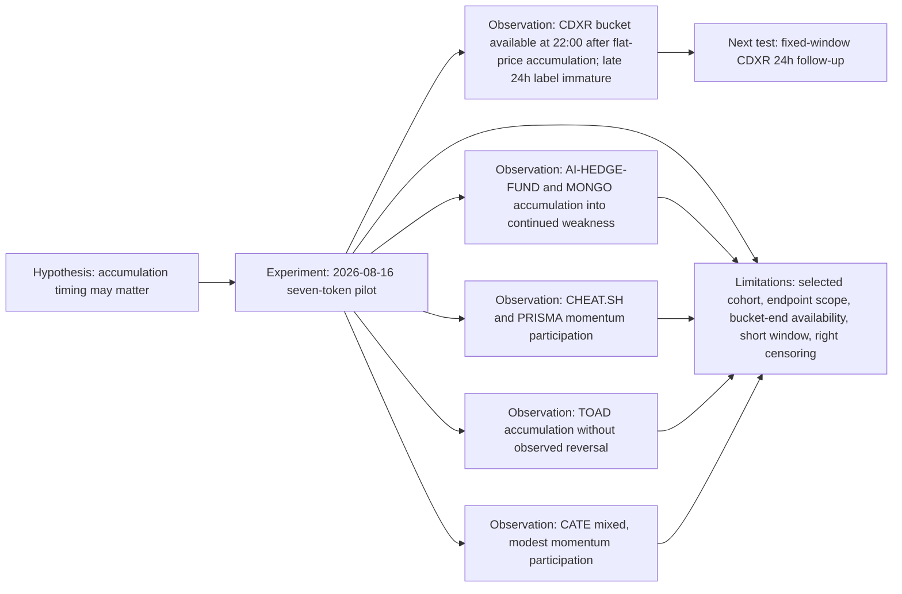

# Research evidence graph

Stable node IDs preserve the lineage from the frozen hypothesis to observations, limitations, and the next test.

Observation evidence:

- [`obs_cdxr_flat_accumulation`](../research/experiments/2026-08-16-seven-token-pilot/REPORT.md#cdxr-label-maturity)
- [`obs_weakness_continues`](../research/experiments/2026-08-16-seven-token-pilot/REPORT.md#event-weighted-timing-analysis)
- [`obs_momentum_participation`](../research/experiments/2026-08-16-seven-token-pilot/REPORT.md#event-weighted-timing-analysis)
- [`obs_toad_no_reversal`](../research/experiments/2026-08-16-seven-token-pilot/REPORT.md#event-weighted-timing-analysis)
- [`obs_cate_mixed`](../research/experiments/2026-08-16-seven-token-pilot/REPORT.md#event-weighted-timing-analysis)

[Powered by Nansen API](https://nansen.ai/). Public evidence follows Nansen's [redistribution guidance](https://docs.nansen.ai/guides/redistribution-guide).
